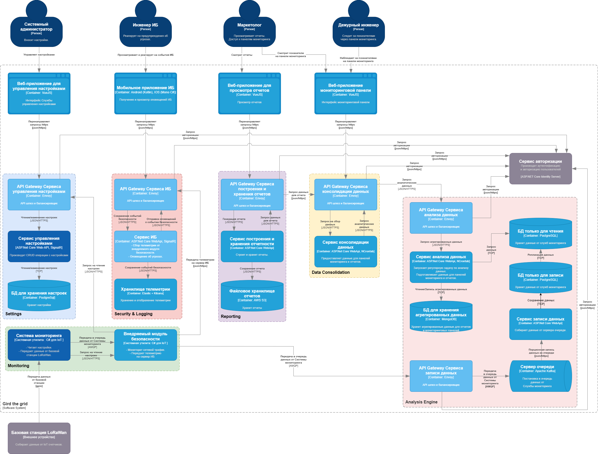

# [Расширение электросети - Gird the Grid](http://nealford.com/katas/kata?id=GirdTheGrid)

## Содержание

* [Описание проблемы](#описание-проблемы)
	- [Бизнес контекст](#бизнес-контекст)  
	- [Бизнес цели и бизнес-драйверы](#бизнес-цели-и-бизнес-драйверы)  
	- [Стейкхолдеры](#стейкхолдеры)
	- [Ограничения технологические и бизнесовые](#ограничения-технологические-и-бизнесовые)
	- [Сценарии масштабируемости](#Сценарии-масштабируемости)
	- [Обеспечение отказоустойчивости](#Обеспечение-отказоустойчивости)
* [Описание требований](#описание-требований)
	- [Пользовательские сценарии](#пользовательские-сценарии)
	- [Сценарии для атрибутов качества](#сценарии-для-атрибутов-качества)
* [Описание решения](#описание-решения)
	- [Контекстная диаграмма](#контекстная-диаграмма)  
	- [Диаграмма контейнеров](#диаграмма-контейнеров)  
	- [Диаграмма развертывания](#диаграмма-развертывания)
	- [Диаграммы последовательности для пользовательских сценариев](#диаграммы-последовательности-для-пользовательских-сценариев)
* [ADR-ADL](#adr-adl)
	- [ADR1 Выбор общей архитектуры решения](#ADR1-Выбор-общей-архитектуры-решения)
	- [ADR2 Реализация модуля Системы мониторинга](#ADR2-Реализация-модуля-Системы-мониторинга)
	- [ADR3 Реализация Внедряемого модуля безопасности](#ADR3-Реализация-Внедряемого-модуля-безопасности)
	- [ADR4 Реализация Сервиса информационной безопасности](#ADR4-Реализация-Сервиса-информационной-безопасности)
	- [ADR5 Реализация Сервиса управления настройками](#ADR5-Реализация-Сервиса-управления-настройками)
	- [ADR6 Реализация Сервиса хранения данных](#ADR6-Реализация-Сервиса-хранения-данных)
	- [ADR7 Реализация Сервиса анализа данных](#ADR7-Реализация-Сервиса-анализа-данных)
	- [ADR8 Реализация Сервиса построения и хранения отчетности](#ADR8-Реализация-Сервиса-построения-и-хранения-отчетности)

## Описание проблемы

Компания, которая создает программное обеспечение для управления электрическими сетями, должна обновить свое устаревшее программное решение и планирует продавать свое предложение в качестве платформы.
- Пользователи: малые и средние компании на рынке электроэнергии, способные обслуживать электрические сети от 100 000 до 1 900 000 потребителей электроэнергии

- Требования:
 * настраиваемые для конкретных характеристик сетевой компании (штат, налоговые ставки и т. д.)
 * современный пользовательский интерфейс
 * панели мониторинга с аналитическими отчетами с данными из сети в режиме, близком к реальному времени
 * отличные возможности отчетности
 * сложный аналитический движок для определения лучшей пропускной способности/цены
 * администрирование с помощью настольных компьютеров или мобильных устройств
 * отчеты о попытках проникновения в систему безопасности

- Дополнительный контекст:
 * надежность на уровне четырех девяток (99,99)
 * развертывание под ключ на удаленных объектах
 * безопасность — первостепенная задача
 * компания хочет перейти от управления электрическими сетями к тому, чтобы стать реселлером программного обеспечения

### Бизнес контекст

На основе существующего программного решения создать конфигурируемый типовой программный продукт (платформу), 
который удовлетворит нужды малых и средних энергокомпаний в мониторинге в реальном времени, анализе и предоставлении отчетности. 

### Бизнес цели и бизнес-драйверы

 * разработка современного платформенного ПО.
 * получение прибыли от продажи усовершенствованного ПО.
 * получение прибыли от технической поддержки и обновлений.
 * сведение к минимуму издержек в случаях взаимодействия, между ПО разных клиентских компаний (платформенная совместимость).

### Стейкхолдеры

* **SH-1**: **Системный администратор**
	- вносит изменения в настройки Системы мониторинга.
	- взаимодействует со службой аутентификации и авторизации.

* **SH-2**: **Инжинер ИБ**
	- реагирует на оповещения системы безопасности.
	
* **SH-3**: **Маркетолог**
	- генерирует и просматривает отчеты.
	- имеет доступ к панелям мониторинга.
	- отдает распоряжение на изменение настроек Системы мониторинга, исходя из показателей отчетов/панелей мониторинга.
	
* **SH-4**: **Дежурный инженер**
	- реагирует на изменения показателей панелей мониторинга.

### Ограничения технологические и бизнесовые

 * Резкое увеличение к-ва пользователей энергосети за короткий промежуток времени: 
	 - Не у всех пользователей могут быть установлены умные счетчики соответствующего стандарта.
	 - Может возникнуть потребность в развертывании дополнительных базовых станций LoRaWan.
	 
 * При большом к-ве пользователей может возникнуть необходимость в кластеризации системы. 

### Сценарии масштабируемости 
 
 * Размещение служб в облаке - позволяет динамически регулировать вычислительные мощности системы. 
 * Использование балансировщиков и контейнеров - позволяет быстро вводить в строй 
	новые сервисные ноды для равномерного распределения нагрузки.
 
### Обеспечение отказоустойчивости 

 * Использование балансировщиков - для равномерного распределения нагрузки.
 * Контейнеризация - быстрый ввод новых нод в случае достижения потолка нагрузки.
 * Автоматическое переключение между нодами.
 * Зеркалирование и своевременное бэкапирование БД - позволяет избегать потери данных.
 * Алертинг - система оповещает о событиях безопасности (Внедряемый модуль безопасности)
	и сбоях (встроенные в сервисы хелзчеки).
 * Микросервисная архитектура - отказ 1 или нескольких подсистем не ложит систему целиком.
 * Нагрузочное тестирование перед периодами пиковых нагрузок - позволяет прогноз по мощностям.
 
## Описание требований

### Пользовательские сценарии

* **UC-1**: **Управление настройками Системы мониторинга**:	
	- Системный администратор (SH-1) авторизуется.
	- Системный администратор (SH-1) просматривает настройки Системы мониторинга.
	- Системный администратор (SH-1) изменяет настройки Системы мониторинга.
	
* **UC-2**: **Генерация и просмотр отчетов**:
	- Маркетолог (SH-3) авторизуется.
	- Маркетолог (SH-3)	генерирует и просматривает отчеты.
	
* **UC-3**: **Доступ к мониторинговым панелям**:
	- Маркетолог (SH-3) или Дежурный инженер (SH-4)	авторизуются.
    - Маркетолог (SH-3) или Дежурный инженер (SH-4) имеют доступ к Панелям мониторинга, и получают сведения о функционировании энергосети в реальном времени.
	
* **UC-4**: **Просмотр событий безопасности**:
    - Сервис получает критичное событие от Внедряемого модуля безопасности.
    - Инженер ИБ получает уведомления Сервиса ИБ о критичном событии.	

* **UC-5**: **Чтение настроек Системой мониторинга**:	
    - Система мониторинга читает настройки из Сервиса настроек через Внедряемый модуль безопасности.

* **UC-6**: **Передача показаний приборов учета от базовой станции**:
	- Система мониторинга отправляет показания от базовой станции (для примера взята базовая станция LoRaWan) в Сервис записи данных через Внедряемый модуль безопасности.

* **UC-7**: **Внедряемый модуль безопасности анализирует запросы**:
	- Внедряемый модуль безопасности анализирует запросы, между Системой мониторинга и внешними сервисами.

* **UC-8**: **Анализ и агрегирование данных**:
    - Сервис записи данных, посредством репликации данных, передает данные Системы мониторинга в Сервис анализа данных.
	- Сервис анализа данных анализирует и агрегирует данные.	
	
* **UC-9**: **Передача агрегированных данных на Мониторинговые панели, либо для построения отчетов**:	
	- Сервис анализа данных по запросу передает данные либо на Мониторинговые панели, либо для построения отчетов в Сервисе построения и хранения отчетов.

### Сценарии для атрибутов качества

* **QA-1**: **Масштабируемость**:
    - ПО должно обслуживать электрические сети от 100 000 до 1 900 000 потребителей электроэнергии.

* **QA-2**: **Доступность**:
    - надежность на уровне четырех девяток (99,99).
	- панели мониторинга с аналитическими отчетами должны содержать данные из сети, полученные в режиме, близком к реальному времени.
	- инженер ИБ должен иметь возможность получать оповещения от Система ИБ через мобильное приложение.
	- развертывание под ключ на удаленных объектах.
	
* **QA-3**: **Безопасность**:
    - Взаимодействие между распределенными частями системы должно быть защищено.
    - инженеры ИБ должны получать сообщения об угрозах ИБ для реагирования на них в максимально короткие сроки.	

* **QA-4**: **Гибкость**:	
    - настраиваемые характеристики для конкретной сетевой компании (штат, налоговые ставки и т. д.).

## Описание решения

### Контекстная диаграмма

Взаимодействие пользователей с системой.

### Диаграмма контейнеров

### Диаграмма развертывания

Требуемые мощности для развертывания системы.

### Диаграммы последовательности для пользовательских сценариев

* **UC-1**: **Управление настройками Системы мониторинга**:	

* **UC-2**: **Генерация и просмотр отчетов**:

* **UC-3**: **Доступ к мониторинговым панелям**:

* **UC-4**: **Просмотр событий безопасности**:

* **UC-5**: **Чтение настроек Системой мониторинга**:	

* **UC-6**: **Передача показаний приборов учета от базовой станции (для примера взята базовая станция LoRaWan)**:	

* **UC-7**: **Как Внедряемый модуль безопасности анализирует запросы**:	

* **UC-8**: **Анализ и агрегирование данных**:	

* **UC-9**: **Передача агрегированных данных для построения отчетов**:	

## ADR-ADL

### ADR1 Выбор общей архитектуры решения

#### Статус

Предложение

#### Контекст

Cуществующее программное обеспечение для управления электрическими сетями устарело и требует обновления.
Одновременно предлагается сделать новое решение гибким, универсальным, безопасным, способным работать надежно под высокой нагрузкой.

#### Решение

Предлагается построить распределенную систему, состоящую из:
 - аппаратно-программного комплекса, устанавливаемого на базовую станцию сбора показаний электросчетчиков (для примера - LoRaWan);
 - программного комплекса для хранения, анаиза, построения отчетов;
 - клиентского ПО для отображения мониторинговых панелей с аналитической информацией, отчетов, управления настройками и информационной безопасностью - в виде мобильных и веб-приложений. 

#### Итоги решения

 - Аппаратно-программный комплекс предполагается строить на базе ARM плат управления (RaspberryPi, OrangePi, BananaPi и пр.).
 - Аппаратно-программный комплекс предполагается подключать к базовой станции через интерфейс gpio.
 - Программный комплекс для хранения, анаиза, построения отчетов предполагается реализовать в виде микросервисной архитектуры.
 - Программный комплекс для хранения, анаиза, построения отчетов предполагается развертывать в ЦОДе у клиента или в облаке.
 - Т.к. система должна обладать характеристикой быстрого реагирования на оповещения безопасности и сбоев, то предполагается разработка мобильного приложения для инженеров ИБ.
 - Приложения мониторинговых панелей, отображения отчетности, управления настройками предполагается реализовать в виде веб-приложений.
 - Для разработки предлагается использовать стек .NET .

### ADR2 Реализация модуля Системы мониторинга

#### Статус

Предложение

#### Контекст

Необходимо передавать показания электросчетчиков от базовой станции (для примера - LoRaWan) для хранения и анализа.

#### Решение

 - Предлагается внедрять на базовых станциях сбора показаний электросчетчиков (для примера - LoRaWan)
   аппаратно-программный комплекс (Система мониторинга) на базе ARM плат управления (RaspberryPi, OrangePi, BananaPi и пр.) с поддержкой IoT платформы Meadow и C# for IoT.

#### Итоги решения

 - Систему мониторинга предполагается строить на базе ARM плат управления (RaspberryPi, OrangePi, BananaPi и пр.).
 - Систему мониторинга предполагается строить на базе IoT платформы Meadow и C# for IoT.
 - Систему мониторинга предполагается подключать к базовой станции через интерфейс gpio.
 - Система мониторинга должна быть конфигурируемой.
 - Данные от Системы мониторинга должны безопасно передаваться для хранения и анализа.

### ADR3 Реализация Внедряемого модуля безопасности

#### Статус

Предложение

#### Контекст

Необходимо безопасно передавать данные от Системы мониторинга для хранения и анализа.

#### Решение

 - Предлагается разработать внедряемый модуль безопасности для анализа сетевого трафика при передаче данных от Системы мониторинга для хранения и анализа.
 - Предлагается вместе с ПО Системы мониторинга прошивать ПО Внедряемого модуля безопасности на плате управления.

#### Итоги решения

 - Предполагается анализировать сетевой трафик при передаче данных от Системы мониторинга для хранения и анализа.
 - Предполагается фиксировать все события нарушения безопасности и сбоев при передаче данных от Системы мониторинга.
 - Внедряемый модуль безопасности предполагается строить на базе IoT платформы Meadow и C# for IoT.
 - Предполагается собирать такие события централизованно и оповещать дежурного инженера ИБ.
 
### ADR4 Реализация Сервиса информационной безопасности

#### Статус

Предложение

#### Контекст

Необходимо собирать события нарушения безопасности и сбоев при передаче данных от Системы мониторинга.
Необходимо оповещать дежурного инженера ИБ о событиях нарушения безопасности и сбоех при передаче данных от Системы мониторинга.

#### Решение

 - Предлагается разработать Сервис ИБ для сбора и хранения события нарушения безопасности и сбоев при передаче данных от Системы мониторинга.

#### Итоги решения

 - Предполагается, что Внедряемый модуль безопасности будет отправлять события нарушения безопасности на шлюз Сервиса ИБ на базе Envoy.
 - Предполагается реализовать Сервис ИБ как ASP.NET Core WebApi.
 - Предполагается, что Сервис ИБ будет сохранять события безопасности в Хранилище телеметрии на базе Elastic + Kibana.
 - Предполагается, что Сервис ИБ будет отправлять посредством SignalR оповещения о событиях безопасности в мобильное приложение (Android, IOS) дежурного инженера ИБ [SH-2].
 - Предполагается, что Мобильное приложение ИБ фактически - PWA + WebView.  

### ADR5 Реализация Сервиса управления настройками

#### Статус

Предложение

#### Контекст

Необходимо иметь возможность хранить и управлять настройками энергосистемы.

#### Решение

 - Предлагается разработать Сервис управления настройками

#### Итоги решения

 - Предполагается, что Система мониторинга будет считывать настройки при запуске, обращаясь к шлюзу Сервиса управления настройками.
 - Предполагается, что Системный администратор [SH-1] будет вносить изменения в настройки через SPA веб-приложение на базе фреймворка VueJS.
 - Предполагается, что Сервис управления настройками будет отправлять Системе мониторинга посредством SignalR оповещения об изменении настроек. 
 - Предполагается реализовать Сервис управления настройками как ASP.NET Core WebApi.
 - Предполагается, что Сервис управления настройками будет сохранять настройки в СУБД PostgreSQL.
 
### ADR6 Реализация Сервиса хранения данных

#### Статус

Предложение

#### Контекст

Необходимо иметь возможность хранить данные, приходящие от Системы мониторинга.

#### Решение

 - Предлагается разработать Сервис записи данных для сохранения raw данных.

#### Итоги решения

 - Ввиду высоконагруженности (от 100 000 до 1 900 000 потребителей электроэнергии), предлагается использовать асинхронные подход к сохранению данных 
	через использование Сервера очереди на базе RabbitMQ.
 - Предполагается, что Система мониторинга будет отправлять данные на шлюз Сервиса записи данных, откуда данные будут попадать на Сервер очереди.
 - Предполагается, что Сервер очереди через Сервис записи данных будет порционно сохранять данные в СУБД PostgreSQL, которая используется только для записи.
 - Предполагается реализовать Сервис записи данных как ASP.NET Core WebApi.

### ADR7 Реализация Сервиса анализа данных

#### Статус

Предложение

#### Контекст

Необходимо анализировать и агрегировать данные для дальнейшего их использования в отчетах и на мониторинговых панелях.

#### Решение

 - Предлагается разработать Сервис анализа данных - для анализа и агрегирования данных.

#### Итоги решения

 - Предполагается, что Сервис анализа данных будет иметь свою СУБД PostgreSQL только для чтения (для построения индексов, например),
   данные в которую будут попадать из СУБД Сервиса записи данных посредством репликации.
 - Предполагается, что Сервис анализа данных будет запускать регулярную задачу для анализа данных в БД только для чтения.
 - Предполагается, что Сервис анализа данных будет сохранять проанализированные и сагрегированные данные в нереляционную БД на базе MongoDB.
 - Предполагается, что дежурный инженер [SH-4] через SPA веб-приложение мониторинговых панелей (на базе фреймворка VueJS)
	запрашивает проанализированные и сагрегированные данные через шлюз Сервиса анализа данных.
 - Предполагается, что Сервис построения и хранения отчетности читает данные через шлюз Сервиса анализа данных.
 - Предполагается реализовать Сервис анализа данных как ASP.NET Core WebApi.

### ADR8 Реализация Сервиса построения и хранения отчетности

#### Статус

Предложение

#### Контекст

Необходимо иметь возможность генерировать и хранить готовые отчеты.

#### Решение

 - Предлагается разработать Сервис построения и хранения отчетности - для генерации отчетов и сохранения готовых отчетов в файловом хранилище.

#### Итоги решения

 - Предполагается, что Маркетолог [SH-3] через SPA веб-приложение (на базе фреймворка VueJS) будет запрашивать отчет через шлюз Сервиса построения и хранения отчетности.
 - Предполагается, что Сервис построения и хранения отчетности будет обращаться за данными для отчета через шлюз Сервиса анализа данных.
 - Предполагается, что Сервис построения и хранения отчетности будет генерировать отчет на основе данных, полученных от Сервиса анализа данных.
 - Предполагается, что Сервис построения и хранения отчетности будет сохранять готовый отчет в файловое хранилище на базе AWS S3.
 - Предполагается, что Сервис построения и хранения отчетности будет отправлять отчет маркетологу [SH-3] в приложение через свой шлюз. 
 - Предполагается реализовать Сервис построения и хранения отчетности как ASP.NET Core WebApi.

