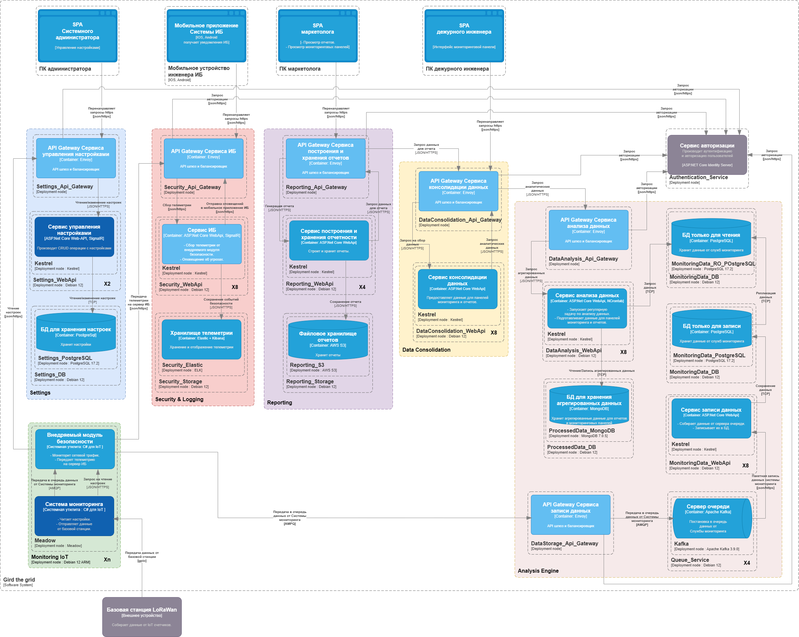

# [Расширение электросети - Gird the Grid](http://nealford.com/katas/kata?id=GirdTheGrid)

## Содержание

* [Описание проблемы](#business-case)
	- [Бизнес контекст](#business-context)  
	- [Бизнес цели и бизнес-драйверы](#business-targets)  
	- [Стейкхолдеры](#stakeholders)
	- [Ограничения технологические и бизнесовые](#constraints)
* [Описание требований](#requirements)
    - [Пользовательские сценарии](#user-cases)
	- [Сценарии для атрибутов качества](#qa-cases)
* [Описание решения](#solution)
	- [Контекстная диаграмма](#context-diagram)  
	- [Диаграмма контейнеров](#container-diagram)  
	- [Диаграмма развертывания](#deployment-diagram)
	- [Диаграммы последовательности для пользовательских сценариев](#sequence-diagram)
* [ADR/ADL](#adr)

## Описание проблемы

Компания, которая создает программное обеспечение для управления электрическими сетями, должна обновить свое устаревшее программное решение и планирует продавать свое предложение в качестве платформы.
- Пользователи: малые и средние компании на рынке электроэнергии, способные обслуживать электрические сети от 100 000 до 1 900 000 потребителей электроэнергии

- Требования:
 * настраиваемые для конкретных характеристик сетевой компании (штат, налоговые ставки и т. д.)
 * современный пользовательский интерфейс
 * панели мониторинга с аналитическими отчетами с данными из сети в режиме, близком к реальному времени
 * отличные возможности отчетности
 * сложный аналитический движок для определения лучшей пропускной способности/цены
 * администрирование с помощью настольных компьютеров или мобильных устройств
 * отчеты о попытках проникновения в систему безопасности

- Дополнительный контекст:
 * надежность на уровне четырех девяток (99,99)
 * развертывание под ключ на удаленных объектах
 * безопасность — первостепенная задача
 * компания хочет перейти от управления электрическими сетями к тому, чтобы стать реселлером программного обеспечения

###	Бизнес контекст

На основе существующего программного решения создать конфигурируемый типовой программный продукт (платформу), 
который удовлетворит нужды малых и средних энергокомпаний в мониторинге в реальном времени, анализе и предоставлении отчетности. 

###	Бизнес цели и бизнес-драйверы

 * разработка современного платформенного ПО.
 * получение прибыли от продажи усовершенствованного ПО.
 * получение прибыли от технической поддержки и обновлений.
 * сведение к минимуму издержек в случаях взаимодействия, между ПО разных клиентских компаний (платформенная совместимость).

###	Стейкхолдеры

* **SH-1**: **Системный администратор**
	- вносит изменения в настройки Системы мониторинга.
	- взаимодействует со службой аутентификации и авторизации.

* **SH-2**: **Инжинер ИБ**
	- реагирует на оповещения системы безопасности.
	
* **SH-3**: **Маркетолог**
	- генерирует и просматривает отчеты.
	- имеет доступ к панелям мониторинга.
	- отдает распоряжение на изменение настроек Системы мониторинга, исходя из показателей отчетов/панелей мониторинга.
	
* **SH-4**: **Дежурный инженер**
	- реагирует на изменения показателей панелей мониторинга.

###	Ограничения технологические и бизнесовые

1) Резкое увеличение к-ва пользователей энергосети за короткий промежуток времени: 
	 - Не у всех пользователей могут быть установлены умные счетчики соответствующего стандарта.
	 - Может возникнуть потребность в развертывании дополнительных базовых станций LoRaWan.
	 
2) При большом к-ве пользователей может возникнуть необходимость в кластеризации системы.

## Описание требований

###	Пользовательские сценарии

* **UC-1**: **Управление настройками Системы мониторинга**:	
	- Системный администратор (SH-1) авторизуется.
	- Системный администратор (SH-1) просматривает настройки Системы мониторинга.
	- Системный администратор (SH-1) изменяет настройки Системы мониторинга.
	
* **UC-2**: **Генерация и просмотр отчетов**:
	- Маркетолог (SH-3) авторизуется.
	- Маркетолог (SH-3)	генерирует и просматривает отчеты.
	
* **UC-3**: **Доступ к мониторинговым панелям**:
	- Маркетолог (SH-3) или Дежурный инженер (SH-4)	авторизуются.
    - Маркетолог (SH-3) или Дежурный инженер (SH-4) имеют доступ к Панелям мониторинга, и получают сведения о функционировании энергосети в реальном времени.
	
* **UC-4**: **Просмотр событий безопасности**:
    - Сервис получает критичное событие от Внедряемого модуля безопасности.
    - Инженер ИБ получает уведомления Сервиса ИБ о критичном событии.	

* **UC-5**: **Чтение настроек Системой мониторинга**:	
    - Система мониторинга читает настройки из Сервиса настроек через Внедряемый модуль безопасности.

* **UC-6**: **Передача показаний приборов учета от базовой станции LoRaWan**:
	- Система мониторинга отправляет показания от базовой станции LoRaWan в Сервис записи данных через Внедряемый модуль безопасности.

* **UC-7**: **Внедряемый модуль безопасности анализирует запросы**:
	- Внедряемый модуль безопасности анализирует запросы, между Системой мониторинга и внешними сервисами.

* **UC-8**: **Анализ и агрегирование данных**:
    - Сервис записи данных, посредством репликации данных, передает данные Системы мониторинга в Сервис анализа данных.
	- Сервис анализа данных анализирует и агрегирует данные.	
	
* **UC-9**: **Передача агрегированных данных на Мониторинговые панели, либо для построения отчетов**:	
	- Сервис анализа данных по запросу передает данные либо на Мониторинговые панели, либо для построения отчетов в Сервисе построения и хранения отчетов.

###	Сценарии для атрибутов качества

* **QA-1**: **Масштабируемость**:
    - ПО должно обслуживать электрические сети от 100 000 до 1 900 000 потребителей электроэнергии.

* **QA-2**: **Доступность**:
    - надежность на уровне четырех девяток (99,99).
	- панели мониторинга с аналитическими отчетами должны содержать данные из сети, полученные в режиме, близком к реальному времени.
	- инженер ИБ должен иметь возможность получать оповещения от Система ИБ через мобильное приложение.
	- развертывание под ключ на удаленных объектах.
	
* **QA-3**: **Безопасность**:
    - Взаимодействие между распределенными частями системы должно быть защищено.
    - инженеры ИБ должны получать сообщения об угрозах ИБ для реагирования на них в максимально короткие сроки.	

* **QA-4**: **Гибкость**:	
    - настраиваемые характеристики для конкретной сетевой компании (штат, налоговые ставки и т. д.).

## Описание решения

###	Контекстная диаграмма

Взаимодействие пользователей с системой.

###	Диаграмма контейнеров

###	Диаграмма развертывания

Требуемые мощности для развертывания системы.

###	Диаграммы последовательности для пользовательских сценариев

* **UC-1**: **Управление настройками Системы мониторинга**:	

* **UC-2**: **Генерация и просмотр отчетов**:

* **UC-3**: **Доступ к мониторинговым панелям**:

* **UC-4**: **Просмотр событий безопасности**:

* **UC-5**: **Чтение настроек Системой мониторинга**:	

* **UC-6**: **Передача показаний приборов учета от базовой станции LoRaWan**:	

* **UC-7**: **Как Внедряемый модуль безопасности анализирует запросы**:	

* **UC-8**: **Анализ и агрегирование данных**:	

* **UC-9**: **Передача агрегированных данных для построения отчетов**:	

## ADR/ADL